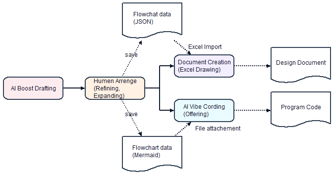
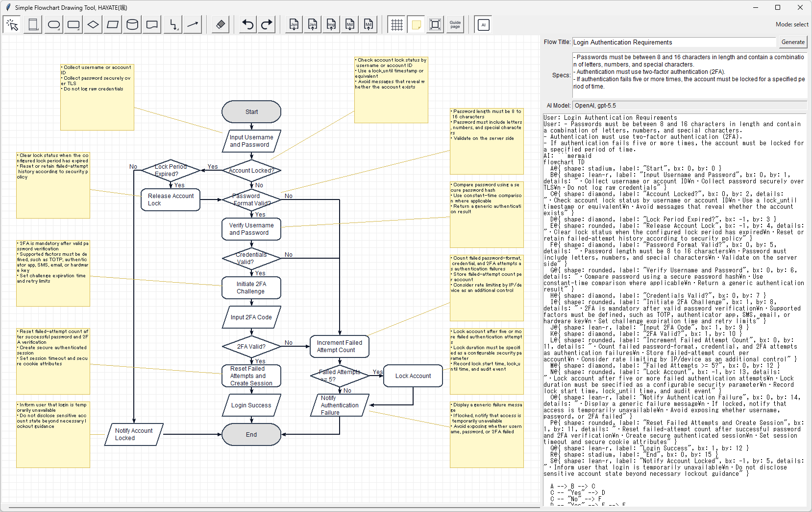
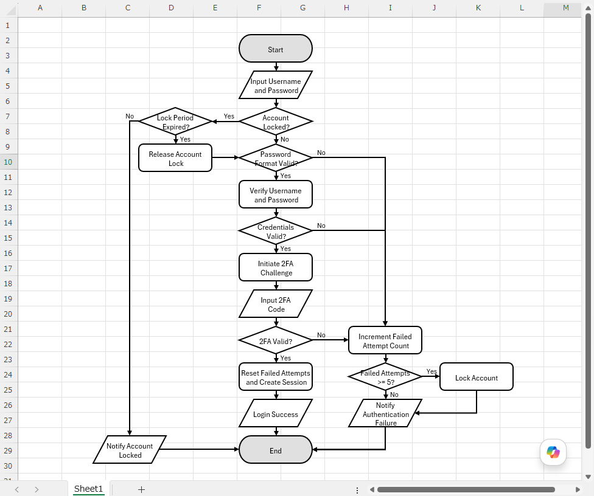

# flowchart-drawing-tool-python
## Simple Flowchart Drawing Tool, HAYATE

## Overview

This project provides a **“Simple Flowchart Drawing Tool 颯(HAYATE)”** that allows users to easily create flowcharts.

## Project Purpose

* When creating flowcharts, have you ever experienced the following frustrations?
  * During the design phase, you want to quickly organize business processes and logic using a flowchart, but you can't find a suitable tool.
  * Even when trying to create flowcharts in Excel, too much time is spent adjusting shapes, leaving little room to focus on the actual flow and logic.
  * Flowcharts generated by AI often have awkward designs, making them difficult to use in real business scenarios and only suitable as rough drafts.
* For those who share these common challenges, we are developing a “casually usable” flowchart drawing tool.
* Since the tool now includes a reasonable set of basic features for quickly creating flowcharts, it has been released as open source.



## Features

* Quickly create, save, and re-edit simple flowcharts
* Automatic routing of links when connecting elements or moving nodes, with manual adjustment support
* Supports both vertical and horizontal swimlanes
* Integration with generative AI (OpenAI GPT, Google Gemini, Anthropic Claude) for automatic flowchart generation (with manual editing available afterward)



* **New Feature (2026.04.07)**: Released VBA for importing flowchart JSON data into Excel and rendering editable flowcharts → significantly reduces Excel diagramming workload



## Installation

### Prerequisites

* Supported OS: Verified on Windows 11 and macOS 26.4
* A Python execution environment with Tkinter Canvas support is required
  (Not supported in web environments such as Google Colab; macOS requires Tkinter setup)
* Git is recommended for checking out the latest code from GitHub

### Installation Steps

1. Open Command Prompt (or Terminator) and prepare a folder for checkout.

2. Move to the folder and clone the repository:

   ```
   git clone https://github.com/YoshiToshi1025/flowchart-drawing-tool-python.git
   ```

3. Install required packages:

   ```
   pip install -r requirements.txt
   ```

4. If you want to use English, overwrite `constants.py` with `constants_en.py`.

5. To use AI-based flow generation:

   * Set API keys in the `.env` file
   * Specify the AI model name in `constants.py`

   ```
   [.env]
   OPENAI_API_KEY=(OpenAI GPT API Key)
   GEMINI_API_KEY=(Google Gemini API Key)
   ANTHROPIC_API_KEY=(Anthropic Claude API Key)
   ```

   ```
   [constants.py]
   AI_MODEL="gpt-5.5"
   ```

   *Note: Manual flowchart creation works without API keys.*

6. Run `flowchart_tool.py` to launch the application.

## Usage

* **Placement**: Select elements (Swimlane, Process, Decision, Terminator, I/O, Storage, Document) from the menu and click on the canvas to place them.
* **Connection**: Select “Link” and click source → destination elements.
* **Text Editing**: Double-click elements or links.
* **Move**: Use “Select” and drag & drop elements.
* **Selection**:

  * Single: Click element
  * Multiple: Drag a rectangular area
* **Delete**: Remove selected elements and their links
* **UNDO/REDO**: Undo or redo recent actions
* **Import/Export**:

  * Export as image (JPEG/PNG) or JSON
  * Import JSON for redraw
* **Grid**: Enable grid snapping
* **AI Generation**:

  * Enable checkbox → enter flow → click Generate
* **Manual Link Adjustment**:

  * CTRL + MouseWheel: change connection points
  * SHIFT + MouseWheel: adjust routing distance
  * CTRL + SHIFT + MouseWheel: adjust label position

*Sample JSON files are available in the `example` folder.*

## Operation

### Expected Usage Flow

* This tool is intended to be used in the following workflow:

  1. Launch the drawing tool
  2. Generate a draft of the expected flow automatically by integrating with generative AI
  3. Create and refine the flowchart (design phase)
  4. Save the completed flowchart data (JSON, Mermaid)
  5. Documentation: Attach the flowchart to specifications by converting JSON data into Excel shapes
  6. Automatic coding of process flows: Attach the flowchart data (Mermaid) to a generative AI prompt to generate code automatically

### Excel VBA Output

* Flowcharts can be automatically generated in Excel from JSON (manual adjustment still required for routing)

## Limitations

* On Windows, image saving may fail when multiple displays have different scaling settings → use screen capture instead
* Excel VBA import is **Windows-only** (macOS version under consideration)

## Notes

* Using AI generation incurs API usage costs depending on the selected AI service.

## Planned Features

* Enhancements for unsupported features in Excel VBA (Windows version)
* Excel VBA support for macOS
* More improvements

## License

* Licensed under the **MIT License**

## Changelog

* 2025/12/12 : Initial release (basic features)
* 2025/12/15 : Improved link routing, image export support
* 2025/12/16 : Various bug fixes and UI improvements
* 2026/01/02 : AI integration (GPT-5.2)
* 2026/01/08 : Display scaling support on Windows
* 2026/02/09 : Node fill color customization
* 2026/03/03 : Swimlane + highlight support
* 2026/03/17 : Canvas resize and scroll support
* 2026/03/23 : Straight links + dashed/dotted styles
* 2026/03/28 : Multi-AI support (GPT, Gemini, Claude)
* 2026/04/06 : JSON output update + Excel VBA beta
* 2026/04/07 : Excel VBA (Windows) official release
* 2026/04/27 : Verified operation with the latest AI models (GPT-5.5, Claude Opus 4.7) / Enabled detailed spec input when generating flows with AI / Added support for Mermaid format output
* 2026/05/01 : Support for switching swimlane orientation (vertical/horizontal) via right-click on the toolbar icon, and updates to the online manual.
* 2026/05/03 : Support for switching element shapes (terminator, process) via right-click on the toolbar icon, and improved handling of label line breaks.
* 2026/05/06 : Support for switching between three elbow-style link routing types (vertical / horizontal / tree) via right-click on the toolbar icon.
* 2026/05/11 : Improved usability (multi-selection with Shift+Click, link connection via drag-and-drop, swimlane selection by area selection of header/footer sections, and swimlane color change with Ctrl+Number)
* 2026/05/13 : Support for importing Mermaid notation data containing only link lines (such as output generated by GENNAI AI tools)
* 2026/05/14 : Finalized the tool name as "Hayate, 颯" and updated the online manual.
* 2026/05/18 : Support for canvas scrolling via wheel-button drag operations, and adjustment of the canvas scroll range when loading data.
* 2026/05/26 : Added a sticky note feature to display and edit detailed descriptions for elements. Sticky notes can be added by double-clicking the mouse wheel on an element. Note: Excel drawing integration has not been implemented yet.
* 2026/05/28 : Fixed minor issues in the sticky note feature, and revised the README and manual.
* 2026/01/01 : Added support for generating standard specifications for each flowchart element during AI-based flow creation and displaying them as sticky notes.

## Notes (Additional)

### Note 1

If package errors occur:

```
pip install -r requirements.txt
```

### Note 2

* Excel VBA import works only on Windows

### Note 3

* Excel VBA works via import only (no additional setup required)
* Usage:

  * Run `DrawFlowchat` macro
  * Select JSON file
  * Auto-draw on active sheet

### Note 4

The Mermaid notation import process supports only four types of elements (Terminator, Process, Decision, and Input/Output) and their link information. Swimlanes and subgraphs are not supported for import.